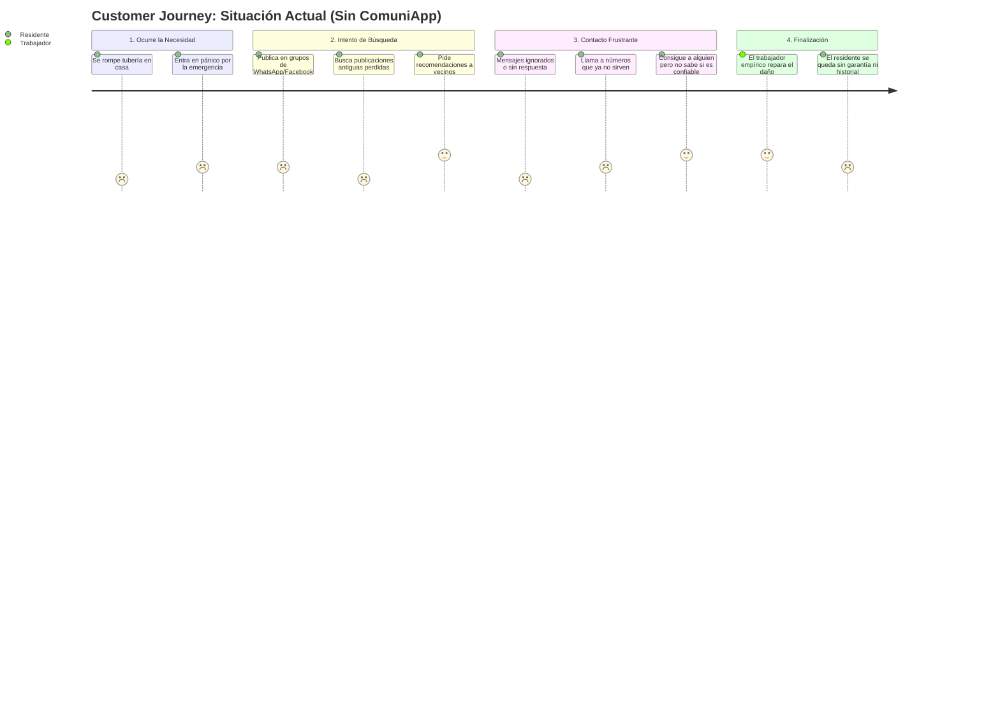

# 4. Customer Journey y User Flow

En esta sección definiremos la experiencia del usuario (Customer Journey) para identificar los puntos de dolor actuales y visualizar cómo nuestra plataforma **ComuniApp** resolverá dichas frustraciones.

## 4.1. Customer Journey Actual (As-Is) - *El problema*
Este mapa describe el proceso actual de un residente que tiene una urgencia en el hogar (ej. fuga de agua) y necesita contactar a un trabajador, sin el uso de ComuniApp.

## 4.2. Customer Journey Ideal (To-Be) - *La Solución*
Este mapa proyecta cómo será la experiencia del residente y del emprendedor local utilizando **ComuniApp** como puente conector.

## 4.3. User Flow (Flujo de Usuario)
Mientras el Customer Journey nos muestra la "experiencia y emoción", el **User Flow** nos define las pantallas y decisiones exactas que el usuario (Residente) tomará **dentro de la aplicación** para cumplir su objetivo principal: *Encontrar y contactar a un prestador de servicio*.

A continuación vemos el flujo de interacción pantalla por pantalla:

```mermaid
flowchart LR
    A([Inicio de App / ComuniApp]) --> B{¿Tiene cuenta?}
    B -- No --> C[Pantalla Registro de Residente]
    C --> D
    B -- Sí --> D[Pantalla Login]
    
    D --> E[Dashboard Principal / Home]
    
    E --> F{¿Qué desea hacer?}
    F -- Buscar servicio --> G[Buscador / Menú Categorías]
    
    G --> H[Selecciona Ej. Plomería]
    H --> I[Pantalla de Resultados - Lista de Plomeros]
    
    I --> J{¿Aplicar filtros?}
    J -- Sí --> K[Filtra por: Calificación, Horario, Cercanía]
    K --> L
    J -- No --> L[Elige a un Plomero de la lista]
    
    L --> M[Perfil del Plomero]
    M --> N[Lee información, horarios y reseñas]
    
    N --> O{¿Le convence?}
    O -- No --> I
    O -- Sí --> P([Botón: Contactar WhatsApp/Chat])
    
    P --> Q([Fin: Acuerdo del servicio y Trabajo Realizado])
```

## 4.4. Conclusiones para el Desarrollo (Requisitos Extrapolados)
Del análisis de los mapas y el flujo del usuario, se extraen las siguientes funcionalidades críticas para el diseño e implementación del sistema:
1. **Módulo de Login y Autenticación** para que exista registro seguro de residentes y emprendedores.
2. **Módulo de Categorías** para organizar la oferta (Plomería, Electricidad, Albañilería, etc.).
3. **Sistema de Perfiles** para que emprendedores detallen su disponibilidad y horarios.
4. **Motor de Búsqueda y Filtros** para que el residente acote la búsqueda por estrellas o disponibilidad.
5. **Sistema de Calificaciones y Reseñas** para generar la confianza.
6. **Módulo de Contacto Directo** (Botón CTA para abrir WhatsApp pre-cargado con mensaje de la emergencia).
